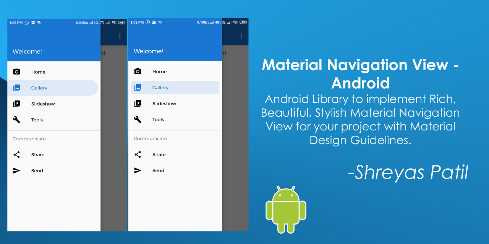
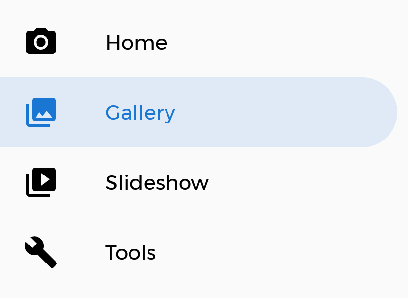
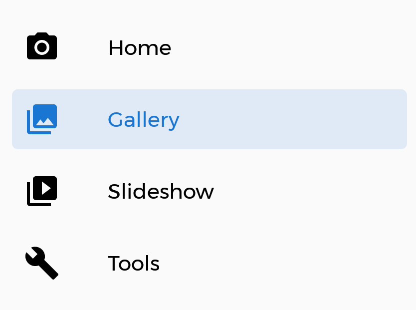

# Material NavigationView for Android 📱

📱 Android Library to implement Rich, Beautiful Material Navigation View for your project with Material Design Guidelines. Easy to use.




# Table of Contents:
> - [ Introduction ](#introduction)
> - [ Implementation ](#implementation)
>    - [ Prerequisite ](#prerequisite)
>    - [ Create `Activity.xml` ](#createActivityXML)
>    - [ Create Activity File](#createActivityCode)
>  
> - [ Migrating from `NavigationView` ](#migrate)
> - [ Fast Implementation ](#fastImplementation)
> - [ Credits ](#credits)    

<a name="introduction"></a>
## Introduction
**MaterialNavigationView** library is built upon Google's Material Design library. This API will be useful to create rich, animated, beautiful Navigation View Drawer in Android app easily. 
It follows all Material Design Guidelines as stated [here](https://material.io). <br>
`MaterialNavigationView` class in this library is inherited from [`com.google.android.material.navigation.NavigationView`](https://github.com/material-components/material-components-android/blob/master/docs/components/NavigationView.md) class. Just only difference is added extra design. <br>
So, we can use it as it is. 

<a name="implementation"></a>
## Implementation
Implementation of Material Navigation View library is so easy. You can check [/app](/app) directory for demo. Let's have look on basic steps of implementation.
In this demo, we will populate The menu contents by a menu resource file.
<a name="prerequisite"></a>
### Prerequisite
#### Gradle
In `Build.gradle` of app module, include these dependencies.
```groovy
dependencies {

    // Material Navigation View Library
    implementation 'com.shreyaspatil:MaterialNavigationView:1.0.0'

    // Material Design Library
    implementation 'com.google.android.material:material:1.0.0'
}
```
#### Set up Material Theme
Setting Material Theme to app is necessary before implementing Material Navigation View library. To set it up, update [`styles.xml`](/app/src/main/res/values/styles.xml) of `values` directory in app.
**`colorSecondary` value is important here because this color is applied to menu item of Navigation View.**
```xml
<resources>
    <style name="AppTheme" parent="Theme.MaterialComponents.Light">
        <!-- Customize your theme here. -->
        <item name="colorPrimary">@color/colorPrimary</item>
        <item name="colorPrimaryDark">@color/colorPrimaryDark</item>
        <item name="colorAccent">@color/colorAccent</item>
        
        <!-- colorSecondary will be applied to Menu item of NavigationView -->
        <item name="colorSecondary">@color/colorPrimary</item>
        ...
    </style>
</resources>
```
These are required prerequisites to implement Material Navigation View library.

<a name="createActivityXML"></a>
### Create Activity XML
This is most commonly used in conjunction with `DrawerLayout` to implement Material navigation drawers. Navigation drawers are modal elevated dialogs that come from the start/left side, used to display in-app navigation links. <br>
NavigationView is a scrollable view that renders a menu resource `(R.menu.<something>)` as a vertical list. It also renders a header view above the menu. <br>
We are creating `activity_main.xml`
```xml
<androidx.drawerlayout.widget.DrawerLayout xmlns:android="http://schemas.android.com/apk/res/android"
    xmlns:app="http://schemas.android.com/apk/res-auto"
    xmlns:tools="http://schemas.android.com/tools"
    android:id="@+id/drawer_layout"
    android:layout_width="match_parent"
    android:layout_height="match_parent"
    android:fitsSystemWindows="true"
    tools:openDrawer="start">

    <!-- Other Stuff here -->

    <com.shreyaspatil.material.navigationview.MaterialNavigationView
        android:id="@+id/nav_view"
        android:layout_width="wrap_content"
        android:layout_height="match_parent"
        app:itemStyle="rounded_right"
        app:menu="@menu/activity_main_drawer" />

</androidx.drawerlayout.widget.DrawerLayout>
```
#### Available Flags
As already mentioned, this class is inherited from `NavigationView`. You can use all exisiting flags of that class. <br>
New important flag here is.
- `itemStyle` - Points to a style of menu item of Navigation drawer. <br>
There are currently 2 menu styles are defined as below
    - `rounded_right`: This flag sets design to menu item of Navigation drawer as ***Rounded Corners at right*** as you can see below.<br>
      
      
      Implemented as follows:
      ```xml
          <com.shreyaspatil.material.navigationview.MaterialNavigationView
            ...
            app:itemStyle="rounded_right"/>
      ```
      
    - `rounded_rectangle`: This flag sets design to menu item of Navigation drawer as ***Rounded Rectangular Corners*** as you can see below. <br>
    
      
      
      Implemented as follows:
      ```xml
          <com.shreyaspatil.material.navigationview.MaterialNavigationView
            ...
            app:itemStyle="rounded_rectangle"/>
      ```
      
Thus, we have successfully implemented design styles of Menu items.      
<a name="createActivityCode"></a>
### Create Activity Code (Java/Kotlin)
All the programmatic way of implementation of `MaterialNavigationView` is same as `NavigationView`. Just change is the class name only. <br>
Two methods are added in this new class as follows..
- ***`setItemStyle(int itemStyle)`*** : This method sets the Item Style of Menu in MaterialNavigationView at runtime.
   `itemStyle` should be one of the following constants :
   - `MaterialNavigationView.ITEM_STYLE_ROUND_RIGHT`
   - `MaterialNavigationView.ITEM_STYLE_ROUND_RECTANGLE`
- ***`getItemStyle()`*** : It returns the value of item style of menu.

Here is a demo of `MaterialNavigationView` in which we will switch item style of NavigationView after selecting menu.

```kotlin
class MainActivity : AppCompatActivity() {
    private lateinit var navView: MaterialNavigationView

    override fun onCreate(savedInstanceState: Bundle?) {
        super.onCreate(savedInstanceState)
        setContentView(R.layout.activity_main)
        ...
        navView = findViewById(R.id.nav_view)
        ...
    }

    override fun onOptionsItemSelected(item: MenuItem): Boolean {
        val itemStyle = when (item.itemId) {
            R.id.action_round_rect -> MaterialNavigationView.ITEM_STYLE_ROUND_RECTANGLE
            R.id.action_round_right -> MaterialNavigationView.ITEM_STYLE_ROUND_RIGHT
            else -> MaterialNavigationView.ITEM_STYLE_ROUND_RIGHT
        }
        navView.setItemStyle(itemStyle)
        
        return false
    }
}

``` 
Thus, we have implemented `MaterialNavigationView`.

<a name="migrate"></a>
## Migrating from `NavigationView`
If you are already using `NavigationView` (`com.google.android.material.navigation.NavigationView`) in your project and want to switch it to `MaterialNavigationView` then you are done! <br>
Do following Changes:
- Change in layout file - Just change package of component from `com.google.android.material.navigation.NavigationView` to `com.shreyaspatil.material.navigationview.MaterialNavigationView` wherever you used it.
- Change in Activity Code - Just change `NavigationView` class to `MaterialNavigationView` and import appropriate package.

:fire: Hurrah! you are done and successfully migrated to `MaterialNavigationView`. Now just *run your app and see magic*.
<a name="credits"></a>

<a name="fastImplementation"></a>
## Fast Implementation
Want to use it fast? Then here it is..<br>
In Android Studio, Right Click -> `New` -> `Activity` -> `Navigation Drawer Activity` and done.
Then Change just package in layout file and class name in Activity code file and you're done. Run your app and see magic :rocket: 


## Credits
This library is built using following open-source libraries.
- [Material Components for Android](https://github.com/material-components/material-components-android)

If you like this library, Please start this repo and share with someone who need it. You can contribute if you have any suggestions or ideas to improve it.
